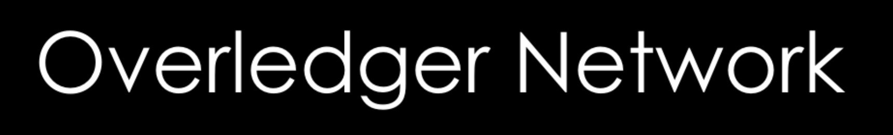

<p align="center">
    
</p>
<p align="center">
    <a href="https://github.com/quantnetwork/overledger-network-gateway/releases" alt="Releases">
        </a>
    <a href="https://twitter.com/intent/follow?screen_name=quant_network">
        </a>
</p>

The instructions below outline the steps to run an Overledger Network Gateway.

## Requirements
- Docker
- Public IP
- Ports 8080 and 11337 open
- BPI Key

## Getting Started
First, we need to run a local instance of MongoDB through Docker. Before we can do that, we need to create a Docker network for the two containers to be able to communicate:
```sh
docker network create ovl-net
```
```sh
docker run -d --name ovl-mongo --network ovl-net -p 27017:27017 mongo:latest
```

## Running
We will now run a container based on the Docker image for the Overledger Network Gateway, passing in the relevant environment variables.

Make sure to replace the values for GATEWAY_ID with your BPI Key, and for GATEWAY_HOST with the Public IP of your machine.

```sh
docker run -dit \
    --name overledger-network-gateway \
    --network ovl-net \
    -p 8080:8080 -p 11337:11337 \
    -e GATEWAY_ID="your-bpi-key" \
    -e GATEWAY_HOST="your-public-IP" \
    -e MONGO_DB_HOST="ovl-mongo" \
    quantnetwork/overledger-network-gateway:latest
```


After running the container, we can follow the logs using:
```sh
docker logs -f overledger-network-gateway
```

The Gateway will start up with a random number of connectors between C1 and C10.
Make sure when submitting requests that you submit them for the connectors that are up, as they toggle on and off on a scheduled basis. You can find the active connectors by checking the latest log entries.

## API

We can now submit mock requests to our Gateway, using the /do-task API:
POST http://localhost:8080/tasks
with the body:
```json
{
	"connectorId": "C1",
	"task": "Send transaction."
}
```

## Upgrading

To upgrade the Overledger Network Gateway, we need to stop the running Docker container, remove the container and pull the newest Docker image. Then, we can start our Gateway again using the command from the running section. Optionally, we can also clean and restart the database by following the same steps.

To list all running containers, as well as containers that have been shut down:

```
docker ps -a
```

Then, we need to pick the ID of the Overledger Network Gateway container, stop it and remove it.

```
docker stop gateway-container-id-here
```

```
docker rm gateway-container-id-here
```

Finally, we have to update the old Overledger Network Gateway image. The default tag that will be pulled is 'latest':

```
docker pull quantnetwork/overledger-network-gateway
```

Now that we have upgraded our Docker image, we can just run the Gateway as we would normally:

```sh
docker run -dit \
    --name overledger-network-gateway \
    --network ovl-net \
    -p 8080:8080 -p 11337:11337 \
    -e GATEWAY_ID="your-bpi-key" \
    -e GATEWAY_HOST="your-public-IP" \
    -e MONGO_DB_HOST="ovl-mongo" \
    quantnetwork/overledger-network-gateway:latest
```
